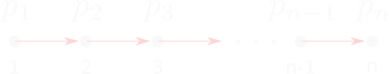

# Introduction

In 1932, Gödel published a brief note showing that the intuitionistic propositional calculus (IPC) cannot be characterized by finite-valued semantics [[1]](#references). Although the argument he employed was brilliant, it was presented in an extremely concise manner (merely two paragraphs!), making it challenging to comprehend. In the subsequent discussion, I will endeavor to present it in a more detailed fashion, addressing any gaps with additional or alternative definitions and arguments. Following Gödel's lead, we will denote the intuitionistic propositional calculus as $\textbf{H}$.

# The strategy

Suppose there is a matrix for $\mathcal{L}$ which validates those, and only those, formulas that are provable in $\textbf{H}$. More formally, we are interested in a finite-valued matrix $\mathcal{M}$ such that,

$$ \forall \varphi \in \mathcal{L}, \mathcal{M} \Vdash \varphi \iff \textbf{H} \vdash \varphi $$

The right-to-left direction ("those") is trivial: just take the usual matrix for classical logic. We are interested in the left-to-right ("only those") direction, which is equivalent to:

$$\neg \exists \varphi \in \mathcal{L}, \mathcal{M} \Vdash \varphi \land \textbf{H} \nvdash \varphi$$

Therefore, if we find a formula $\varphi$ valid in $\mathcal{M}$ and show that this formula is not provable in $\textbf{H}$, we are forced to reject $\mathcal{M}$ as an adequate characterization of $\textbf{H}$. The strategy of Gödel's argument will be to show that, given any finite-valued matrix strong enough to validate every formula provable in $\textbf{H}$, this matrix will necessarily validate also a formula not provable in $\textbf{H}$, implying that no finite-valued matrix can satisfy only the formulas provable in intuitionistic propositional calculus.

In what follows, we will show that, for every $n > 1$, 

1. [$F_{n+1}$ is valid in any appropriate $n$-valued matrix;](#step1)
2. [$F_n$ is not intuitionistically valid.](#step2)

## $F_{n+1}$ is valid in any appropriate $n$-valued matrix

### Preliminaries

> (**Language**) We will use $\mathcal{L}$ to denote the set of every wff induced by the unary connective $\neg$ and the binary connectives $\land, \lor, \to, \leftrightarrow$ in a countable infinite set of propositional letters $\{ p_0, p_1, \ldots \}$.

> (**Matrix**) A matrix for $\mathcal{L}$ is a tuple $\mathcal{M} = \langle \mathcal{V}, \mathcal{D}, \mathcal{O} \rangle$ where $\langle  \mathcal{V}, \mathcal{O} \rangle$ is an algebra for $\mathcal{L}$ and $\mathcal{D} \subset \mathcal{V}$ is the set of designated values.

> (**Valuation function**) Given a matrix $\mathcal{M} = \langle \mathcal{V}, \mathcal{D}, \mathcal{O} \rangle$, a valuation in $\mathcal{M}$ is a function $v : \mathcal{L} \rightarrow \mathcal{V}$ such that, for every $n$-ary connective $\circ$ and every $\alpha_1,\ldots,\alpha_n \in \mathcal{L}$,
>$$v (\circ(\alpha_1, \ldots, \alpha_n)) = \tilde \circ (v(\alpha_1),\ldots,v(\alpha_n))$$ where $\tilde \circ \in \mathcal{O}$ is the algebraic counterpart of the connective.

> (**Valid formula**) We say that a formula $\varphi \in \mathcal{L}$ is valid in a matrix $\mathcal{M} = \langle \mathcal{V}, \mathcal{D}, \mathcal{O} \rangle$ if, and only if, for every valuation function $v$, $v(\varphi) \in \mathcal{D}$. We will denote this as $\mathcal{M} \Vdash \varphi$.

### The class $F_n$

Consider the following family of formulas, defined for every $n > 1$:

$$F_n = \bigvee_{1\leq i < k \leq n} (p_i \leftrightarrow p_k)$$

where $p_i$ and $p_k$ are propositional letters. Here are some examples.

| n | $F_n$ | 
|- | - |
| 2 | $p_1 \leftrightarrow p_2$ | 
| 3 | $(p_1 \leftrightarrow p_2) \lor (p_1 \leftrightarrow p_3) \lor (p_2 \leftrightarrow p_3)$ | 
| 4 | $(p_1 \leftrightarrow p_2) \lor (p_1 \leftrightarrow p_3) \lor (p_1 \leftrightarrow p_4) \lor (p_2 \leftrightarrow p_3) \lor (p_2 \leftrightarrow p_4) \lor (p_3 \leftrightarrow p_4)$ |

> **Lemma 1** Let $n \geq 1$. For every n-valued matrix $\mathcal{M}$ such that $\mathcal{M} \Vdash (p \leftrightarrow p) \lor q$, we have that $\mathcal{M} \Vdash F_{n+1}$.

> **Proof** Let $\mathcal{M} = \langle \mathcal{V}, \mathcal{D}, \mathcal{O} \rangle$, where $\mathcal{V} = \{ 1, 2, \ldots, n \}$, be a matrix. By definition, a valuation in $\mathcal{M}$ is a function $v : \mathcal{L} \to \mathcal{V}$. Assume that $\mathcal{D} \subset V$ is the set of designated values. We want to show that, for every $v$, $v(F_{n+1}) \in \mathcal{D}$. Let $v'$ be a valuation function. Now, note that $F_{n+1}$ have $n+1$ propositional letters and, by hypothesis, we have only $n$ truth-values. By the **pigeonhole principle**, we are forced to conclude that there are at least two propositional letters, say $p_i$ and $p_j$, such that $v'(p_i) = v'(p_j)$ (**A**). Now, let us rearrange the expression in the following way: $F_{n+1} = (p_i \leftrightarrow p_j) \lor \varphi$ and let $\beta = (p \leftrightarrow p) \lor q$. By hypothesis, for every valuation $v$ in $\mathcal{M}$, $v(\beta) \in \mathcal{D}$. In particular, $v'(\beta) \in \mathcal{D}$. By uniform substitution, $v'(\beta[p_i / p, \varphi / q]) \in \mathcal{D}$ (**B**). Now, by definition of valuation function, 
$$v'(F_{n+1}) = \tilde \lor (\tilde \leftrightarrow(v'(p_i),v'(p_j)),v'(\varphi))$$ Using (**A**) and (**B**), we conclude that $v'(F_{n+1}) \in \mathcal{D}$, as desired.

As a consequence of this lemma, we can conclude, for instance, that in the usual $2$-valued matrix for classical logic, the formula $(p \leftrightarrow q) \lor (p \leftrightarrow r) \lor (q \leftrightarrow r)$ is valid. More generally, every $F_n$ with $n \geq 3$ is true in classical logic. As a consequence of the next lemma, we will conclude that the same is not the case on IPC.

## $F_n$ is not intuitionistically valid

<figure>

    
  

  <figcaption align="center">Figure 1. Sn illustrated.</figcaption>
</figure>

### The algebra $S_n$

The idea is: given any index $n > 1$, we can construct a Heyting algebra, called $S_n$, on which there is a valuation, called the *canonical valuation* $h$, where $h(F_n) \not \in \mathcal{D}$.

> (**$S_n$**) Given some $n > 1$, define the universe of the algebra as $\{ 1, 2, \ldots, n \}$, which are ordered in the usual way, and set the designated value as $1$. Now, define the operators as: 
$$a \lor b = min(a,b) \\ a \land b = max(a,b) \\
a \to b = 1 \text{ for } a \geq b \text{ and }a \to b = b \text{ for } a < b\\
\neg a = n \text{ for } a \neq n \text{ and } \neg n = 1
$$

> (**Remark**) To reconstruct the argument using the same algebra as provided by Gödel, we will subtract $\leftrightarrow$ from our language and redefine $\varphi \leftrightarrow \psi$ as a notation for $(\varphi \to \psi) \land (\psi \to \varphi)$.

> (**Canonical valuation**) Let $h$ be a valuation function in $S_n$, such that, for each propositional letter $p_i$, $h(p_i) = i$, as illustrated by Figure 1.

### Recursive $F_n$

We will provide an alternative definition of $F_n$, called as recursive $F_n$ (or $rF_n$), which will be useful to prove the next lemma.

> (**$rF_n$**) Given $n > 1$, let $rF_n$ be the formula defined as follows:
$$rF_2 = p_1 \leftrightarrow p_2\\
rF_{n+1} = rF_n \lor \bigvee_{1\leq i < n} (p_i \leftrightarrow p_{n+1})$$

The following is straightforward:

> **Proposition** For every $n$, $F_n = rF_n$.

Now, using this new definition of $F_n$, we can easily prove the following lemma by induction.

> **Lemma 2** For every $n > 1$, $h(rF_n) = 2$.

> **Proof** Induction on $n$. (**Base case**) By definition of $h$, $h(p_1) = 1$ and $h(p_2) = 2$. Therefore, $h(p_1 \leftrightarrow p_2) = max(h(p_1 \to p_2), h(p_2 \to p_1)) = max(2,1) = 2$. (**Inductive step**) Assume that $h(rF_n) = 2$. By definition of $rF_{n+1}$, $h(rF_{n+1}) = min(h(rF_n), h(\bigvee_{1\leq i < n} (p_i \leftrightarrow p_{n+1}))) = min(2,h(\bigvee_{1\leq i < n} (p_i \leftrightarrow p_{n+1})))$ (**A**). Note that, for every $i$, $i < n$. Therefore, $h(p_i) < h(p_{n+1})$. By definition of $h$, $h(p_i \leftrightarrow p_{n+1}) = max(h(p_i \to p_{n+1}), h(p_{n+1} \to p_i)) = max(n+1,1) = n+1$. Therefore, $h(\bigvee_{1\leq i < n} (p_i \leftrightarrow p_{n+1})) = n+1$. Using (**A**), we get that $h(rF_{n+1}) = min(2,n+1) = 2$.

From this lemma, we can conclude that, for every $n > 1$, $h(rF_n) \neq 1$. Therefore, $h(rF_n) \not \in \mathcal{D}$. Using the Proposition above with Lemma 2, we get:

> **Corollary** For every $n > 1$, $S_n \nVdash F_n$.

And then, using the completeness of the Heyting algebra $S_n$ with respect to the intuitionistic propositional calculus, we get:

> **Corollary** For every $n > 1$, $\textbf{H} \nvdash F_n$.

> (**Remark**) As another interesting consequence of the pigeonhole principle, we can conclude that, for every $n > 1$, $S_n \Vdash F_{n+1}$.

# References

**[1]** 'On the intuitionistic propositional calculus (1932)' em Gödel, Kurt. Kurt Gödel: collected works: volume I: publications 1929-1936. Vol. 1. Oxford University Press, USA, 1986.